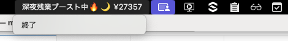

# Money Ticker 💴

勤務時間と稼ぎをリアルタイムで可視化するmacOSステータスバーアプリケーション。



## Features

- **リアルタイム表示**: ステータスバーに現在の稼ぎを1秒ごとに更新表示
- **4つの勤務モード**: 定時・残業・深夜・深夜残業を自動判定
- **わかりやすい表示**: 時給から自動計算された稼ぎを円単位で表示
- **シンプルな起動**: ターミナルから時間と時給を入力するだけ

## Installation


### Build from Source

```bash
git clone https://github.com/yourusername/money-ticker.git
cd money-ticker
go run main.go
```

## Requirements

- macOS
- Go 1.21以上（ビルドする場合）

## Usage

1. ターミナルでアプリを起動:
   ```bash
   cd money-ticker
   go run main.go
   ```
2. 勤務開始時間を入力 (HH:MM形式):
   ```
   勤務開始時間 (HH:MM)
   09:30
   ```
3. 時給を入力 (円):
   ```
   時給(円)
   1500
   ```
4. ステータスバーに稼ぎが表示されます
5. 終了する場合は、ステータスバーの「終了」をクリック

## Display Modes

アプリは勤務状況に応じて自動的に表示を切り替えます:

| モード | 条件 | 割増率 | 表示例 |
|--------|------|--------|--------|
| **定時** | 9時間未満 & 6時～22時 | 1.0倍 | `現在の稼ぎ ¥12000` |
| **残業** | 9時間以上 & 6時～22時 | 1.25倍 | `残業ブースト中🔥 ¥15000` |
| **深夜勤務** | 9時間未満 & 22時～6時 | 1.25倍 | `深夜勤務中🌙 ¥12000` |
| **深夜残業** | 9時間以上 & 22時～6時 | 1.5倍 | `深夜残業ブースト中🔥🌙 ¥18000` |


